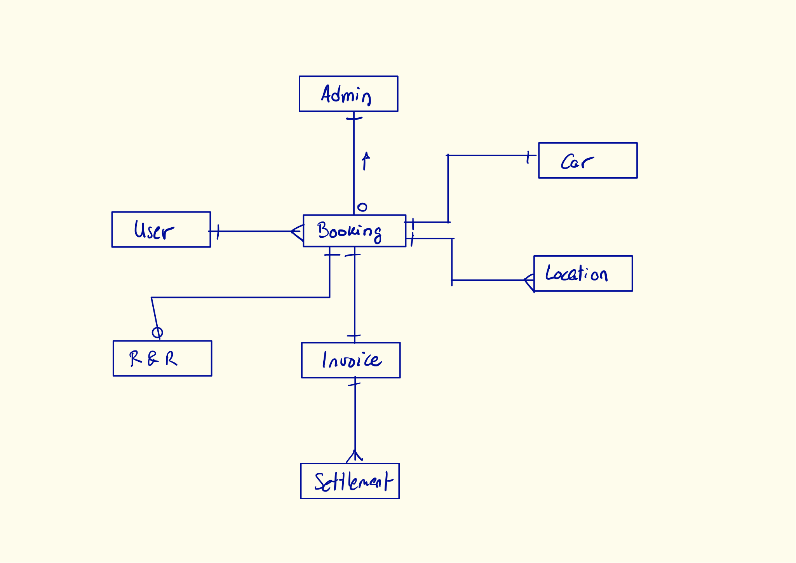

# JAUC Admin Panel

 
 
 

The admin panel allows authenticated users to manage and deploy autonomous cars.

## Mock-server
This project uses a mock-server setup to avoid outside dependencies.
To find more information, please visit the [mock-data documentations](./documentation/mock-data.md).

## Angular Documentation

To get more help on the Angular CLI use `ng help` or go check out the [Angular CLI README](https://github.com/angular/angular-cli/blob/master/README.md).
